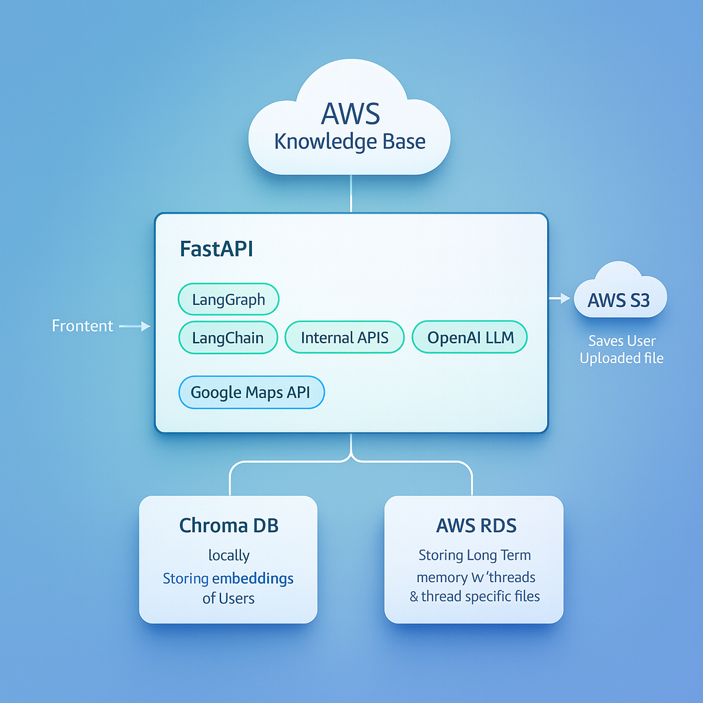

# Architecture Diagram

# Agent Flow

## 📈 p99 Latencies by Node Type

| Node                            | Function                    | Model / Service                                 | p99 Latency (seconds) |
| ------------------------------- | --------------------------- | ----------------------------------------------- | --------------------- 
| **reset_state / check_back**    | State mgmt & routing        | Lightweight internal logic                      | **0.5 – 1.0s**        
| **retrieve (AWS KB)**           | Enterprise retrieval        | **AWS Knowledge Base** + vector search          | **2.5 – 3.5s**        
| **transform_query**             | Text cleaning / expansion   | **Small LLM (gpt-4o-mini)**                     | **1.5s**              
| **web_search / extract_layers** | External / hybrid retrieval | HTTP-bound                                      | **3.5s**              
| **compute_capacity**            | Analytical evaluation       | **Mid-size model ( GPT-o1-mini)**               | **3.0s**              
| **generate / rag_report**       | Final synthesis             | **Large LLM (GPT-4-o)**                         | **5.0s**             
| **ChromaDB / PostgreSQL I/O**   | Memory + embedding ops      | Local / network DB                              | **<0.5s**             

---

## ⚡ End-to-End Latency (p99 Summary)

| Tier                        | Process                                                             | p99 Latency     | Dominant Node(s)                |
| --------------------------- | ------------------------------------------------------------------- | --------------- | ------------------------------- |
| **Fast path (light query)** | reset → retrieve → generate (small LLM)                             | **4 sec**       | retrieve (KB) + transform_query |
| **Average workflow**        | retrieve (KB) + Chroma fetch + generate (medium LLM)                | **8 sec**       | KB + LLM                        |
| **Complex RAG (multi-hop)** | retrieve (KB) + transform + compute_capacity + generate (large LLM) | **18 sec**      | KB latency + LLM inference      |

